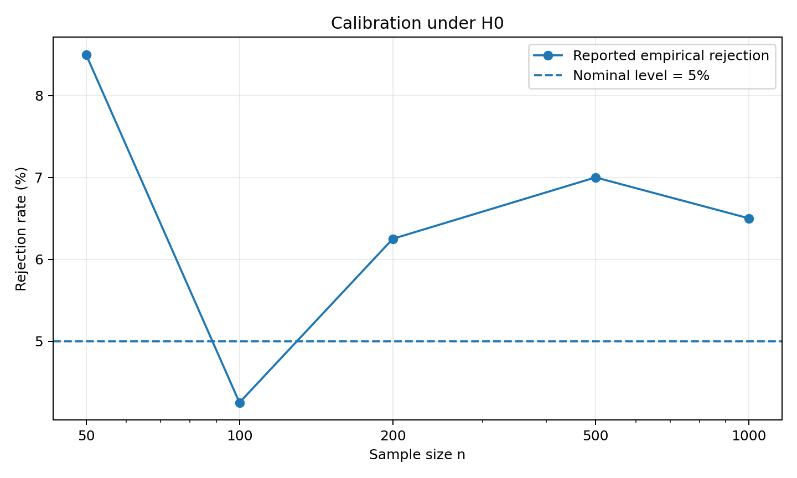
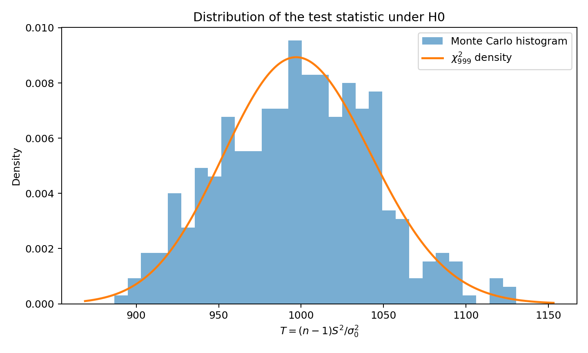
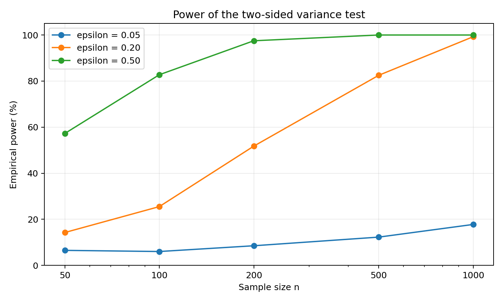
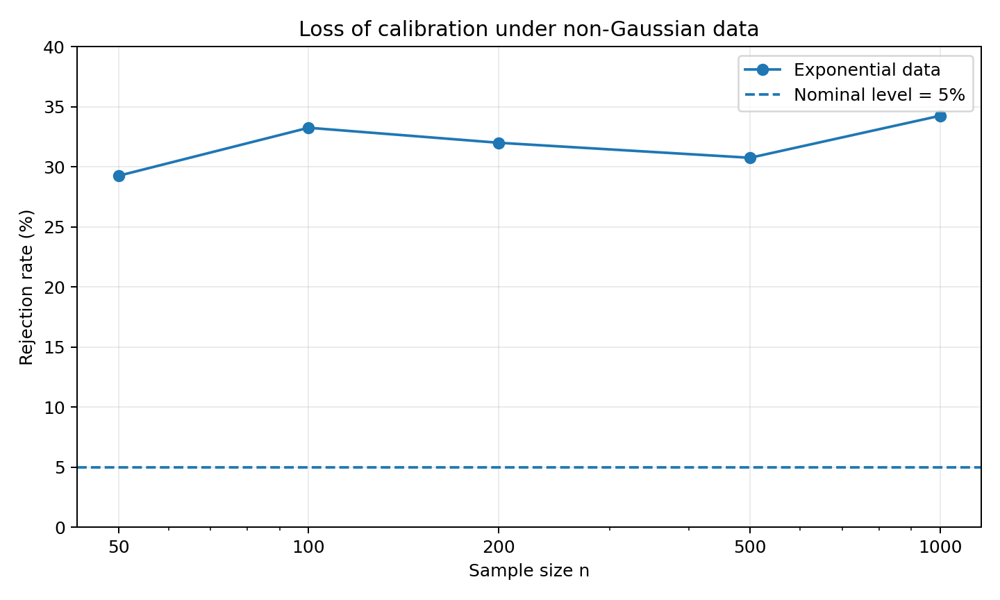
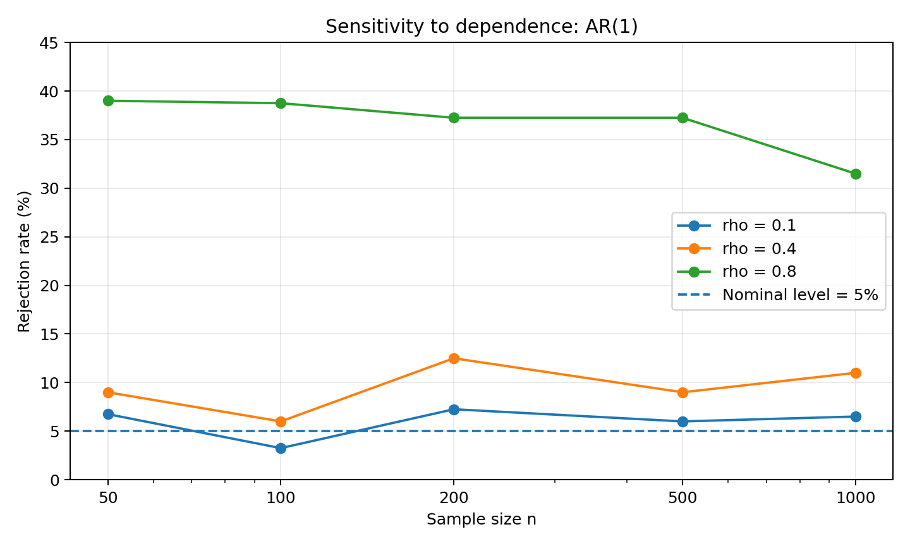

# Variance Test Robustness

Statistical study of the classical two-sided **chi-square test for a population variance**, combining theoretical derivation with Monte Carlo experiments in R.

The project evaluates three aspects of the test:

- calibration under the null hypothesis;
- empirical power when the true variance differs from the reference value;
- robustness when the Gaussian and independence assumptions are violated.

This project was completed in GM3 (Applied Mathematics) at INSA Rouen Normandie.

## Statistical problem

For independent Gaussian observations

$$
X_1, \ldots, X_n \sim \mathcal{N}(\mu, \sigma^2),
$$

the goal is to test

$$
H_0 : \sigma^2 = \sigma_0^2
\qquad \text{against} \qquad
H_1 : \sigma^2 \neq \sigma_0^2.
$$

Using the corrected sample variance

$$
S^2 = \frac{1}{n-1}\sum_{i=1}^{n}(X_i-\bar X)^2,
$$

Cochran's theorem gives, under $H_0$,

$$
T = \frac{(n-1)S^2}{\sigma_0^2}
\sim \chi^2_{n-1}.
$$

For a significance level $\alpha$, the two-sided test rejects $H_0$ when

$$
T < \chi^2_{\alpha/2,n-1}
\quad \text{or} \quad
T > \chi^2_{1-\alpha/2,n-1}.
$$

## Main experiments

The academic study uses

$$
\sigma_0^2 = 1, \qquad \alpha = 0.05,
$$

with 400 Monte Carlo replications for each scenario and sample sizes

$$
n \in \{50,100,200,500,1000\}.
$$

### 1. Calibration under the null

For independent Gaussian data with variance $1$, the empirical rejection rate stays around the nominal 5% level.



The statistic also follows the expected chi-square shape under the null hypothesis.



### 2. Empirical power

The alternative is parameterized by

$$
\sigma^2 = \sigma_0^2 + \varepsilon,
$$

with $\varepsilon \in \{0.05,0.2,0.5\}$.



The simulations show the expected behavior: power increases with both sample size and the magnitude of the variance deviation.

### 3. Robustness to non-Gaussian data

The same chi-square test is applied to exponential samples with the same theoretical variance. The rejection rate rises to roughly 30-34%, far above the nominal 5% level.



This illustrates that the exact chi-square variance test is highly sensitive to the normality assumption.

### 4. Robustness to dependence

Dependence is introduced with a stationary AR(1) process

$$
X_t = \rho X_{t-1} + \varepsilon_t,
$$

where

$$
\operatorname{Var}(\varepsilon_t)
= \sigma_0^2(1-\rho^2).
$$



Weak dependence has a limited effect, while strong autocorrelation ($\rho=0.8$) causes a large inflation of the type-I error rate.

## Repository structure

```text
variance-test-robustness/
├── R/
│   └── variance_test.R
├── scripts/
│   ├── run_analysis.R
│   └── generate_report_figures.py
├── results/
│   ├── figures/
│   └── tables/
├── docs/
│   └── report.pdf
├── Makefile
├── requirements-figures.txt
├── .gitignore
└── README.md
```

## Run the R analysis

Requirements: a recent installation of R. No external R package is required.

```bash
Rscript scripts/run_analysis.R
```

or

```bash
make analysis
```

The script writes reproducible simulation outputs to `results/tables/` and generated plots to `results/figures/`.

## Regenerate the README figures

The committed `*_reported.csv` tables reproduce the numerical values contained in the original academic report. The original simulations did not record a random seed, so a new Monte Carlo run can differ slightly.

For the README figures based on these reported values:

```bash
python3 -m venv .venv
source .venv/bin/activate
pip install -r requirements-figures.txt
make figures
```

The Python helper is only used to regenerate the presentation figures; the statistical project itself is implemented in R.

## Reported numerical results

### Null calibration

| n | 50 | 100 | 200 | 500 | 1000 |
|---:|---:|---:|---:|---:|---:|
| Rejection rate (%) | 8.50 | 4.25 | 6.25 | 7.00 | 6.50 |

### Empirical power

| $\varepsilon$ | 50 | 100 | 200 | 500 | 1000 |
|---:|---:|---:|---:|---:|---:|
| 0.05 | 6.50 | 6.00 | 8.50 | 12.25 | 17.75 |
| 0.20 | 14.25 | 25.50 | 51.75 | 82.50 | 99.25 |
| 0.50 | 57.25 | 82.75 | 97.50 | 100.00 | 100.00 |

### Exponential data

| n | 50 | 100 | 200 | 500 | 1000 |
|---:|---:|---:|---:|---:|---:|
| Rejection rate (%) | 29.25 | 33.25 | 32.00 | 30.75 | 34.25 |

### AR(1) dependence

| $\rho$ | 50 | 100 | 200 | 500 | 1000 |
|---:|---:|---:|---:|---:|---:|
| 0.1 | 6.75 | 3.25 | 7.25 | 6.00 | 6.50 |
| 0.4 | 9.00 | 6.00 | 12.50 | 9.00 | 11.00 |
| 0.8 | 39.00 | 38.75 | 37.25 | 37.25 | 31.50 |

> Note: the original report contains a typographical error in the AR(1) table header where the `n = 500` column is displayed as `n = 50`. The R source and experiment definition use `n = 500`.

## Key takeaway

The classical chi-square variance test is well calibrated and increasingly powerful when its Gaussian i.i.d. assumptions hold. Its validity degrades strongly under skewed non-Gaussian data or substantial serial dependence, which motivates checking assumptions before applying the test and considering robust or resampling-based alternatives when they fail.

## Authors

- Manh Hung Nguyen
- Tan Minh Duy Ngo

Academic project supervised by Michel Bobbia, INSA Rouen Normandie.
